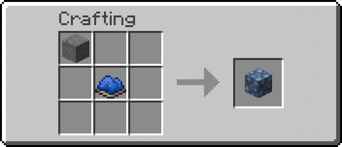
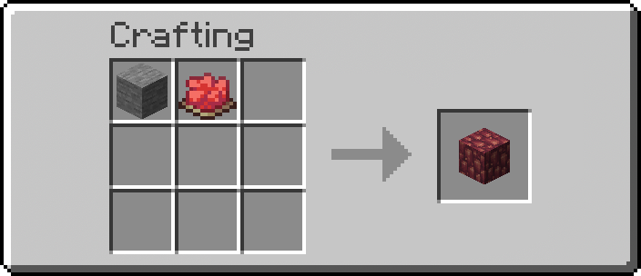
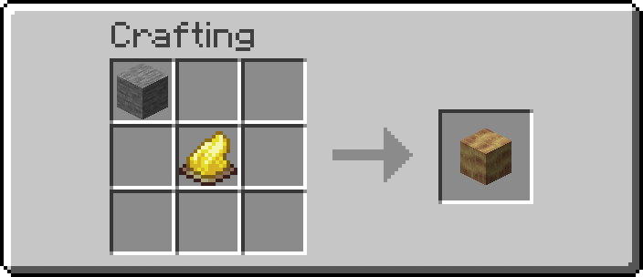
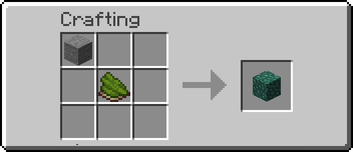
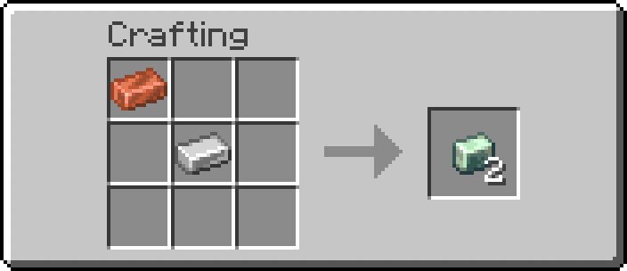

# Create Tweaks: Retro-Generation Recipes

A Minecraft Datapack designed for the **Create Mod**, specifically tailored for worlds that were generated *before* the Create mod was installed. 

Since the Create mod introduces new blocks to world generation (like Asurine, Crimsite, Ochrum, Veridium, and Zinc Ores), players usually have to explore far-off, ungenerated chunks to find them. This datapack solves that issue by adding **custom crafting recipes** for all of Create's natural generation blocks! 

You don't need to generate new chunks anymore; you can simply craft what you need using existing resources.

## Features

This datapack includes crafting recipes for the following Create mod materials:

<div align="center">

<table>
<tr>
<td align="center">
<br/>
<b>Asurine</b>
</td>
<td align="center">
<br/>
<b>Crimsite</b>
</td>
</tr>
<tr>
<td align="center">
<br/>
<b>Ochrum</b>
</td>
<td align="center">
<br/>
<b>Veridium</b>
</td>
</tr>
<tr>
<td align="center" colspan="2">
<br/>
<b>Zinc Ingot</b>
</td>
</tr>
</table>

</div>

## Installation

1. Download or clone this repository.
2. Locate your Minecraft world folder.
3. Open the `datapacks` folder inside your world folder (`saves/<WorldName>/datapacks/`).
4. Drop the `createtweaks` folder there.
5. In-game, run the command `/reload` to apply the datapack.

## Supported Versions

The availability of this datapack is tied directly to the specific versions of the base mod available on the platform. Because official updates for the original mod concluded at version 1.21.8, this pack targets the modern continuation fork, **Create Fly**, for newer releases. 

### Confirmed Minecraft Versions
* 26.1.2 (via Create Fly)
* 1.21.11 (via Create Fly)
* 1.21.10 (via Create Fly)
* 1.21.8 (via Official Create Mod)

### Legacy Version Support
While these are the officially provided builds, earlier versions of the original Create Mod are structurally compatible. The datapack can be manually ported to older versions by adjusting the metadata and recipe formats according to the specifications outlined in the repository wiki.

## Recipe Unlocking & The Recipe Book

By default in Minecraft, custom recipes act like "secret recipes"—they will not show up in your Recipe Book until you successfully craft them at least once. 

To ensure you can easily look up these new recipes in-game without having to guess the patterns, this datapack handles the unlocking automatically! Inside the initialization structure, a `/recipe give` command is executed whenever the datapack is loaded (such as when you type `/reload`). This instantly grants the new recipes to all players, making them visible in the crafting book immediately.

## How It Works & Customization

The datapack is structured in a standard Minecraft data format. If you want to change what items are required for crafting and what they yield, you can easily tweak it.

### Modifying Recipes
All recipes are stored as simple JSON files. To change them:
1. Navigate to `data/createtweaks/recipe/`.
2. Open the JSON file for the recipe you want to tweak (e.g., `zinc_ingot.json`, `asurine.json`, etc.).
3. You will see an `ingredients` section (what you need to craft it) and a `result` section (what you get). 
4. Replace the item IDs (like `minecraft:stone` or `minecraft:iron_nugget`) with whatever items you prefer!

**Example Structure:**
```json
{
  "type": "minecraft:crafting_shapeless",
  "ingredients": [
    {
      "item": "minecraft:iron_ingot"
    },
    {
      "item": "minecraft:copper_ingot"
    }
  ],
  "result": {
    "item": "create:zinc_ingot",
    "count": 1
  }
}
```

### Advanced: Functions (`load.mcfunction` & `tick.mcfunction`)
This datapack also hooks into the `#minecraft:load` and `#minecraft:tick` events:
- **`data/createtweaks/function/load.mcfunction`**: Runs exactly once when the server/client loads the datapack or `/reload` is run. This is where the `/recipe give` command lives to automatically unlock the recipes for players. It's also useful for setting up scoreboards or initial game rules.
- **`data/createtweaks/function/tick.mcfunction`**: Runs once *every single tick* (20 times a second). Useful for checking player conditions or ongoing events. By default, this is mostly empty to preserve performance, but you can add your custom commands here if needed.
